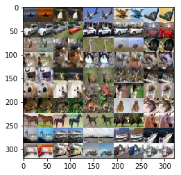

# colorize

Image colorization in Python using PyTorch on Google Colaboratory.

**Please remember to cite sources if you are using this project as a reference!**

## Usage

* Import the Jupyter notebook `Colorize.ipnyb` to Google Colab

or

* Save a copy of my [Google Colab Colorize Notebook](https://colab.research.google.com/drive/145RFYR24FJJTLM3jlZvuKSbbh75IIau_)

### Demo: CIFAR10 Dataset

Left: image colorized from grayscale, Right: original image

## Licensing 

Dual-licensed under Apache and MIT licenses.
